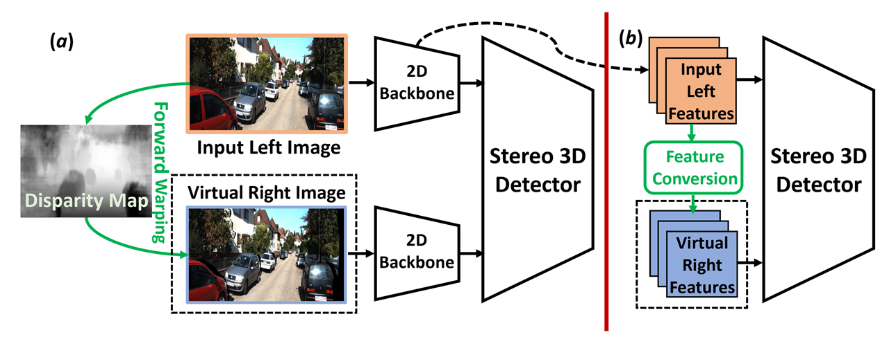

# Pseudo-Stereo for Monocular 3D Object Detection in Autonomous Driving. (CVPR 2022)<font size=3>[\[Paper\]](https://arxiv.org/abs/2203.02112) [\[Supplementary file\]](pdf/supplementary_file.pdf)</font>
<font size=4> Authors: Yi-Nan Chen, [Hang Dai](https://scholar.google.com/citations?hl=en&user=6yvjpQQAAAAJ&view_op=list_works) and Yong Ding




The code is coming soon.

# Citation
```
@InProceedings{Chen_2022_CVPR,
    title={Pseudo-Stereo for Monocular 3D Object Detection in Autonomous Driving},
    author={Yi-Nan Chen and Hang Dai and Yong Ding},
    booktitle = {Proceedings of the IEEE/CVF Conference on Computer Vision and Pattern Recognition (CVPR)},
    month     = {June},
    year      = {2022},
}
```
# Acknowledgements
 We would like to thank the repositories as follow:

 [stereo-from-mono](https://github.com/nianticlabs/stereo-from-mono)

 [LIGA-Stereo](https://github.com/xy-guo/LIGA-Stereo)

 [visualDet3D](https://github.com/Owen-Liuyuxuan/visualDet3D)

 [OpenPCDet](https://github.com/open-mmlab/OpenPCDet)
 
 [D4LCN](https://github.com/dingmyu/D4LCN)


